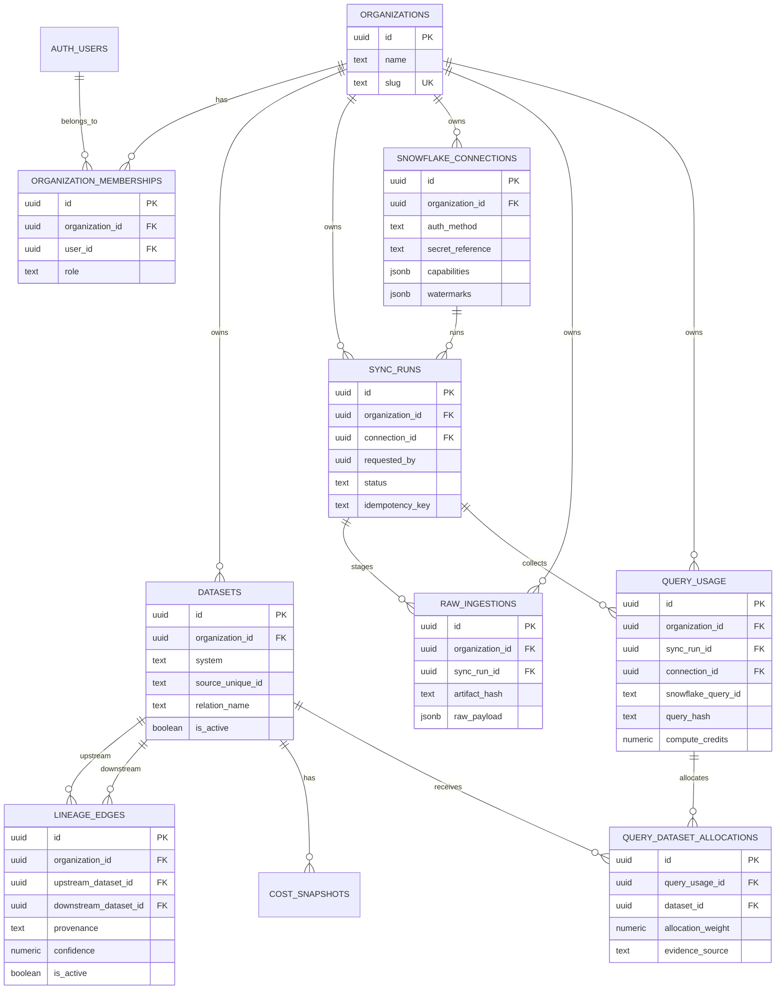

# Tibbou database schema

Tenant-owned tables include `organization_id`; `query_dataset_allocations` derives tenant scope through its `query_usage` and `dataset` foreign keys. RLS and explicit FastAPI filters enforce the same boundary. `auth.users` remains Supabase-managed. The legacy application `users` table is retained only until existing rows can be reviewed safely and is not part of the active identity model.
