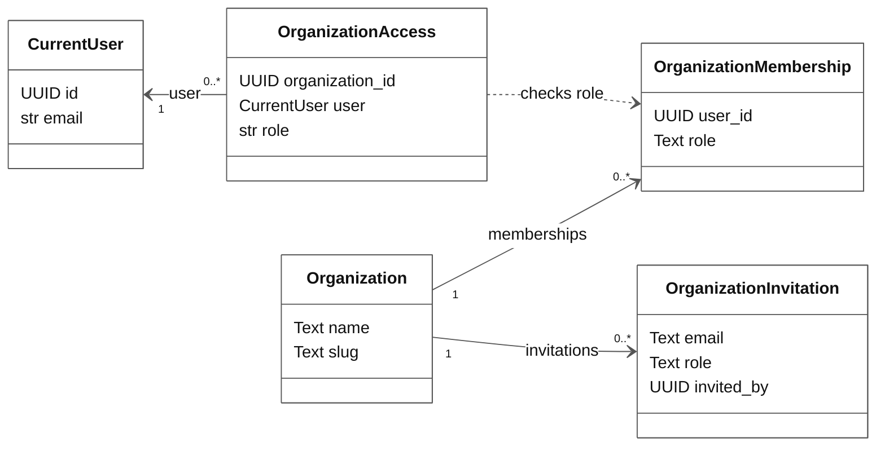
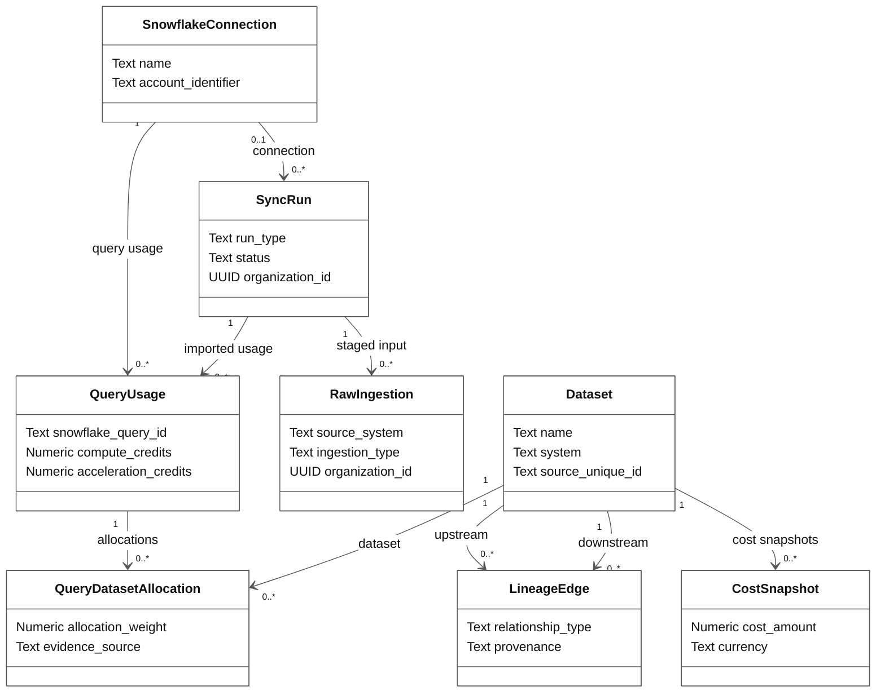

# Tibbou class diagram

These two views match the class-diagram structure in the current Capstone II DDS. They show important software objects, selected attributes, and relationships. They are not table definitions; keys and database details are in the [database schema](database-schema.md).

## Identity and organization access

Diagram ID: `classes-identity`.

`CurrentUser` is the signed-in identity for a request. `OrganizationAccess` records the organization and role that FastAPI approved for that request. It depends on a matching membership; the dotted arrow shows this runtime check rather than a stored class relationship.

Membership roles are `owner`, `admin`, `operator`, and `viewer`. Invitation roles are `admin`, `operator`, and `viewer`. An invitation stores the recipient email and the inviter ID because the recipient may not have an account yet.

## Data, lineage, and ingestion

Diagram ID: `classes-data-ingestion`.

`Dataset` represents a data asset. A lineage edge connects one upstream dataset to one downstream dataset, and a cost snapshot records monetary cost for one dataset and time period.

Snowflake connections can start synchronization runs. Runs hold queued processing work, raw ingestions hold staged source input, and query usage records Snowflake credits. A query-to-dataset allocation records which datasets were associated with a query and each dataset's share of the reported credits.

A dbt run can have no Snowflake connection. The application model requires each new raw ingestion to belong to a run; the deployed database still permits a missing run only for retained older rows.

## Operations implemented outside model classes

The diagrams do not invent methods. Authentication checks are in [auth.py](../../Backend/app/auth.py), invitation operations are in [invitations.py](../../Backend/app/api/routes/invitations.py), ingestion work is in [ingestion.py](../../Backend/app/services/ingestion.py), and graph drawing is handled by the React [LineageGraph](../../Frontend/tibbou-data-flow/src/components/LineageGraph.jsx).

The legacy `User` model remains for old data, but active login uses Supabase Auth. The current design does not include `User.authenticate()`, a global role enum, a backend `LineageVisualGraph` class, SSO fields on users, or visual edge-cost fields.

## Sources

[Models](../../Backend/app/models), [request identity and organization access](../../Backend/app/auth.py), and [database constraints](database-schema.md). Omitted attributes still exist in the source models; shorter class boxes only make the design easier to read.
