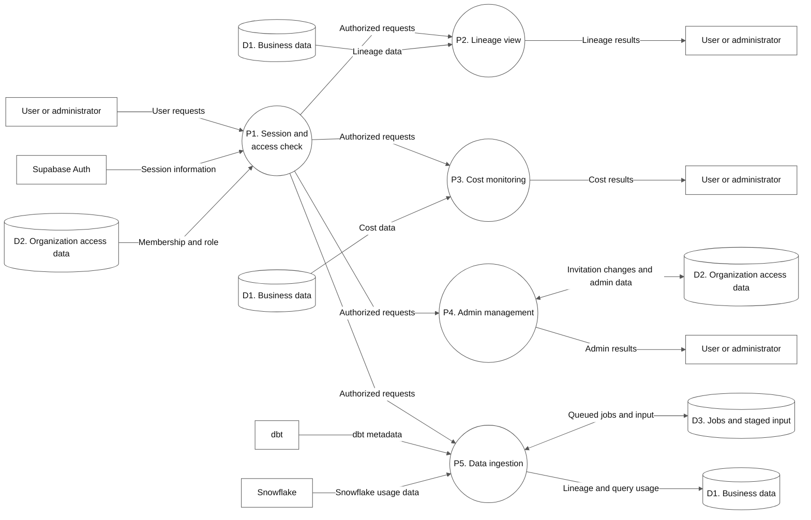
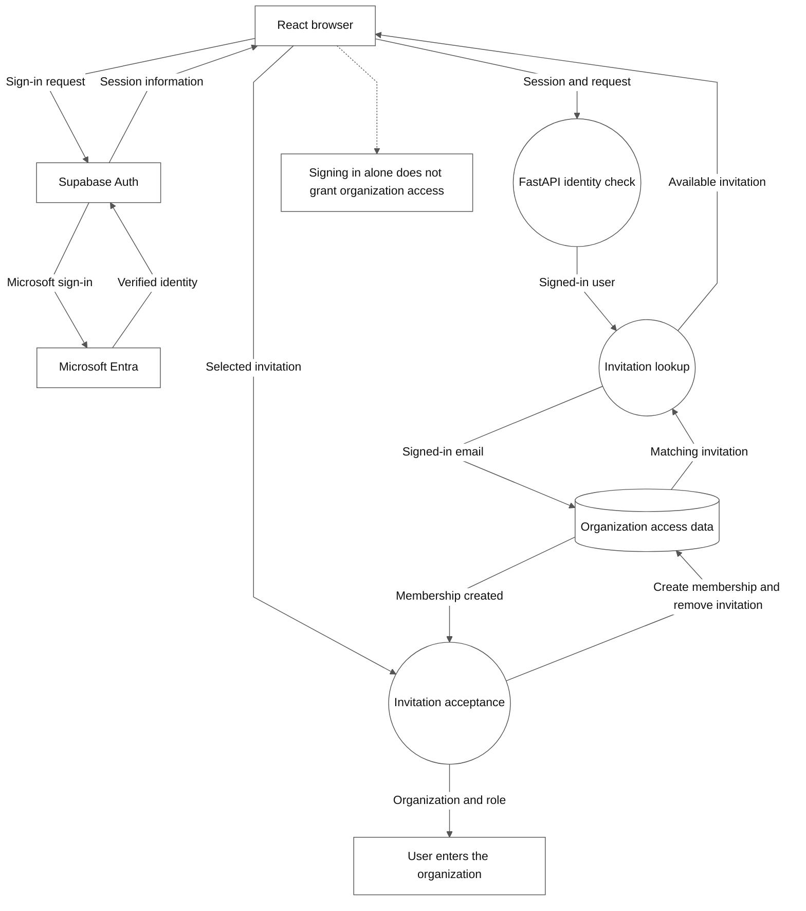

# Tibbou data flow

Diagram ID: `dfd-main`.

P1 combines the signed-in session with organization membership and role checks. It sends allowed requests to the other process groups. P2 and P3 read stored lineage and cost data.

P4 supports the Admin Dashboard and invitation changes. P5 groups the API and worker steps that queue and process dbt metadata or Snowflake usage data. Repeated user and data-store boxes refer to the same actor or logical store; they keep the diagram readable.

The three data stores are logical groups inside the same PostgreSQL database. D1 contains datasets, lineage, cost, and query usage. D2 contains organizations, memberships, roles, and invitations. D3 contains queued runs and staged input.

## Supplemental detailed view: authentication and invitation onboarding

Diagram ID: `dfd-onboarding`.

This diagram expands the onboarding flow. It's just extra technical documentation and is not included in the current DDS.

Supabase Auth handles Microsoft sign-in and returns the browser session. FastAPI then checks the signed-in identity. Invitation lookup returns only an unexpired invitation for the signed-in user's email; an email domain or provider name never grants organization access.

When the user accepts an invitation, the backend checks the recipient again, creates the membership with the invited role, and removes the used invitation. React reloads the user's organizations and enters the workspace after membership exists.

## Detailed behavior kept out of the diagrams

- FastAPI validates the Supabase access token before any protected operation.
- Invitation lookup uses the signed-in user's full email and ignores expired invitations.
- Acceptance prevents duplicate membership and completes the membership creation and invitation removal together.
- Missing or invalid identity, unavailable invitations, and existing membership return safe API errors. Exact HTTP codes remain in the route and test documentation.
- dbt input is uploaded through the browser, while the worker reads Snowflake usage through the configured server-side connection.
- The worker claims queued runs, processes them, records the result, and retries failed work within its configured limit.

## Relevant API interfaces

| Method and path | Purpose | Access |
| --- | --- | --- |
| `GET /api/v1/organizations` | List organizations backed by membership | Signed-in user |
| `GET /api/v1/organizations/{organization_id}/admin` | Read Admin Dashboard data | Owner or administrator |
| `POST /api/v1/organizations/{organization_id}/invitations` | Create an invitation | Owner or administrator |
| `DELETE /api/v1/organizations/{organization_id}/invitations/{invitation_id}` | Revoke an invitation | Owner or administrator |
| `GET /api/v1/invitations` | List invitations for the signed-in email | Signed-in user with an email |
| `POST /api/v1/invitations/{invitation_id}/accept` | Join the invited organization | Matching invited user |
| `GET /api/v1/organizations/{organization_id}/datasets` and `/lineage` | Read datasets and active lineage | Any organization role |
| `GET /api/v1/organizations/{organization_id}/costs` | Read stored monetary cost snapshots | Any organization role |
| `POST /api/v1/organizations/{organization_id}/ingestion/dbt/manifest` | Queue dbt metadata | Owner, administrator, or operator |
| `POST /api/v1/organizations/{organization_id}/ingestion/snowflake/query-usage` | Queue Snowflake usage import | Owner, administrator, or operator |

## Sources

[Authentication settings](../../Frontend/tibbou-data-flow/src/lib/authConfig.js), [organization context](../../Frontend/tibbou-data-flow/src/contexts/OrganizationContext.jsx), [workspace gate](../../Frontend/tibbou-data-flow/src/components/WorkspaceGate.jsx), [identity checks](../../Backend/app/auth.py), [invitation routes](../../Backend/app/api/routes/invitations.py), [ingestion routes](../../Backend/app/api/routes/ingestion.py), and [worker](../../Backend/app/worker.py).
