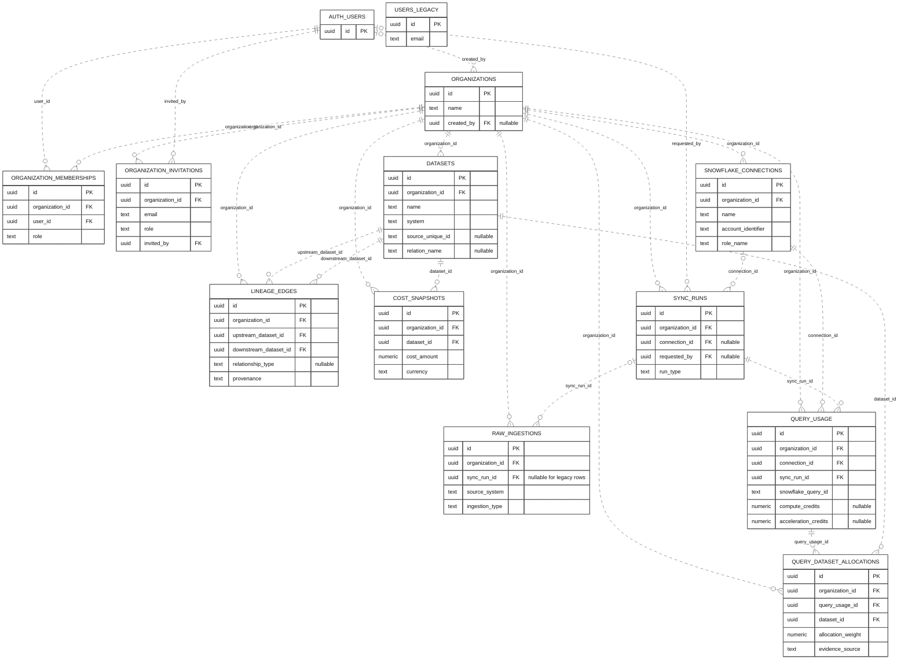

# Tibbou database schema

This unified entity-relationship diagram matches the database view in the current Capstone II DDS. Only fields needed to understand identity, organization ownership, lineage, ingestion, and query usage are shown.

Every application table has its own UUID primary key, so relationships are non-identifying. `AUTH_USERS` is a small reference to Supabase-managed `auth.users`. `USERS_LEGACY` is the retained old application user table and is not used for active login.

## Unified Tibbou database schema

Diagram ID: `erd-unified`.

Users join organizations through memberships, and each membership stores the user's role. Invitations belong to an organization and record the inviting user. The recipient is stored as an email because the person may not have an account yet; accepting an invitation creates membership and removes the invitation.

Organizations own the application data. Datasets connect to lineage edges as both upstream and downstream objects, and cost snapshots belong to datasets. Snowflake connections start usage-import runs; runs connect to staged input and query usage. Query-to-dataset allocations connect each query to the datasets associated with it.

`USERS_LEGACY` is deliberately disconnected. Supabase `AUTH_USERS` is the active identity source.

## Relationship notes

- An organization creator is optional. Creation does not replace membership.
- Every membership has one organization and one Supabase user.
- Every invitation has one organization and one inviter. There is no permanent invitation-to-membership link.
- Both dataset references on a lineage edge are required.
- A synchronization run may have no Snowflake connection for a dbt upload. Its requester can become empty if the related auth user is removed.
- A raw ingestion may lack a run only for retained older data. New raw ingestions must have a run.
- Each query usage row has one Snowflake connection and one run.
- Each query-to-dataset allocation has one query usage record and one dataset.

## Important keys and rules

| Table | Important rules |
| --- | --- |
| `organizations` | Unique slug; optional creator references Supabase users. |
| `organization_memberships` | One membership per organization and user; role is owner, admin, operator, or viewer. The last owner is protected from removal or demotion. |
| `organization_invitations` | One invitation per organization and email; role is admin, operator, or viewer; invitation expires after creation. Accepted invitations are deleted. |
| `datasets` | Source identity is unique within an organization and source system when a source ID exists. |
| `lineage_edges` | One stored edge per endpoint pair, relationship type, and source; an edge cannot point from a dataset to itself. |
| `cost_snapshots` | Period end must be after period start; cost and optional usage amounts cannot be negative. |
| `snowflake_connections` | Connection names are unique inside an organization. Supported authentication methods are external OAuth, workload identity, and key pair. |
| `sync_runs` | A repeated request key is unique inside an organization when present; run status is limited to known job states. |
| `raw_ingestions` | New rows require a run; status is limited to known ingestion states. |
| `query_usage` | A Snowflake query ID is unique for its organization and connection; credit values cannot be negative. |
| `query_dataset_allocations` | One row per query and dataset; the weight is greater than zero and no more than one. |
| `users` | Legacy email and password data; no active route uses this table for login. |

Composite uniqueness is described in the table instead of marking each participating field as individually unique. Ordinary timestamps, raw payloads, error text, retry fields, indexes, triggers, policies, and migration metadata are intentionally omitted from the diagram.

## Organization separation and deletion behavior

Business tables require an organization ID. FastAPI resolves the user's membership and sets the organization for the current database transaction. Database rules then allow access only to records for that organization and role. This extra database check is commonly called row-level security.

Migrations define separate runtime and worker roles without a general bypass. The deployed schema inspection confirmed that the organization-separation rules are enabled and forced, but it did not test the privileges of the running API login.

Deleting an organization is restricted while owned business data remains. Organization creator and synchronization-run requester or connection references can become empty. Invitation inviter deletion removes the related invitation. Query usage, allocation, and raw-ingestion relationships restrict deletion of referenced records.

## Sources

[Core migration](../../Database/alembic/versions/20260408_203100_create_core_tables.py), [tenancy and ingestion migration](../../Database/alembic/versions/20260818_120000_add_tenancy_auth_and_ingestion.py), [organization ownership migration](../../Database/alembic/versions/20260901_120000_finalize_organization_ownership.py), [invitation migration](../../Database/alembic/versions/20260910_120000_add_organization_invitations.py), [models](../../Backend/app/models), [organization access checks](../../Backend/app/auth.py), and the read-only deployed-schema review at revision `20260910_120000`.
