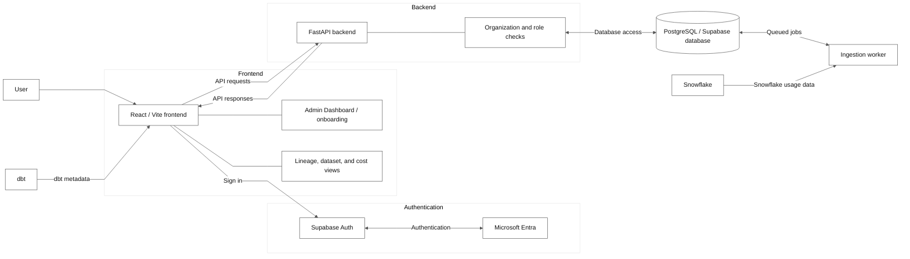

# Tibbou system architecture

This diagram shows the main parts of Tibbou and the connections between them. Detailed request checks and worker steps are described in the [data-flow document](data-flow.md).

## Current system architecture

Diagram ID: `architecture`.

The user works through the React application. Supabase Auth manages the session and uses Microsoft Entra for Microsoft sign-in. The frontend sends authenticated business requests to FastAPI, which checks organization membership and the required role before reading or changing application data.

PostgreSQL stores organizations, memberships, invitations, datasets, lineage, costs, query usage, and queued work. Database rules help keep one organization's data separate from another organization's data. The worker processes queued dbt and Snowflake ingestion jobs and stores the results.

dbt is an uploaded metadata source, not an online service called by Tibbou. Snowflake supplies query usage and accessed-object data. Snowflake credits and monetary cost snapshots remain separate data products.

## Supporting technical notes

- The browser uses Supabase only for authentication. Business data goes through FastAPI.
- FastAPI validates the Supabase access token and resolves access from organization memberships. Signing in alone does not grant organization access.

## Sources

[App routes](../../Frontend/tibbou-data-flow/src/App.jsx), [Supabase client](../../Frontend/tibbou-data-flow/src/lib/supabase.js), [provider settings](../../Frontend/tibbou-data-flow/src/lib/authConfig.js), [API client](../../Frontend/tibbou-data-flow/src/api/tibbou.js), [identity and membership checks](../../Backend/app/auth.py), [worker](../../Backend/app/worker.py), and [ingestion](../../Backend/app/services/ingestion.py).
